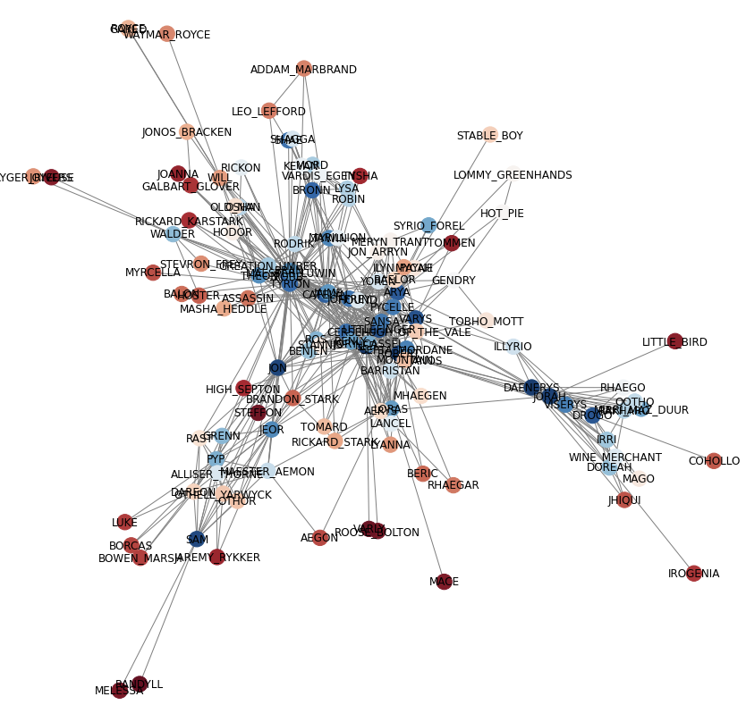

# Network Visualization : Draw Network In Communities

Using Networkx 's built-in layout tool, we can only use color to suggest which community the nodes belong to.
But with this calculating method, you'll be able to visualize nodes in their related communities.

Here I use the network dataset from Game of Thrones S1 as the example

