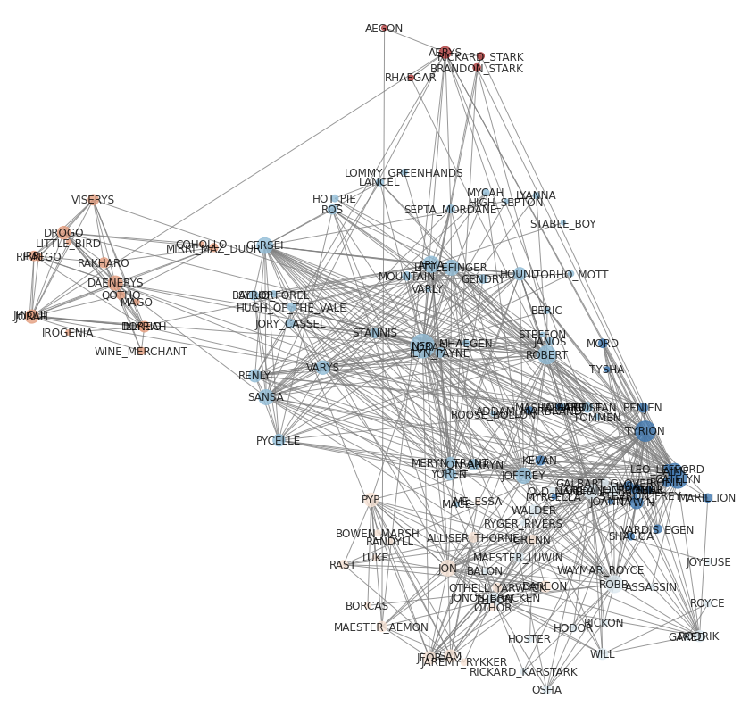

# NetworkVisualization
DrawNetworkInCommunities

(Here I use the network dataset from Game of Thrones S1)

Using Networkx 's built-in layout tool, we can only use color to suggest which community the nodes belong to.

With this calculating method, you'll be able to visualize nodes in their related communities.

